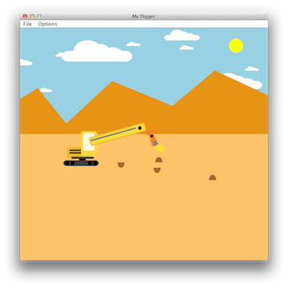
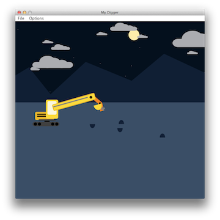

Digger-Jubel
============

A digger that the user can operate using direct manipulation. The interface allows the user to control individual parts of the digger. This is achieved using two-dimensional transformation matrices using Java2D, which enforces the concepts of geometry using homogeneous coordinates and matrix transforms.

As of now the digger only digs and drops dirt, but doesn't actively seek anything in its digging. However, this java code provides an example of how to get moving graphics and to allow the user to manipulate an object. Here are two snapshots of the digger.

